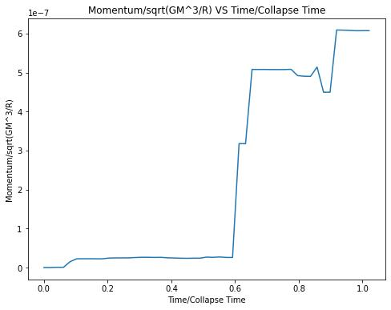
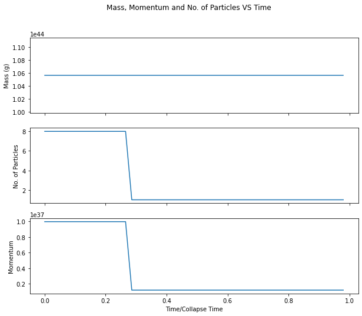
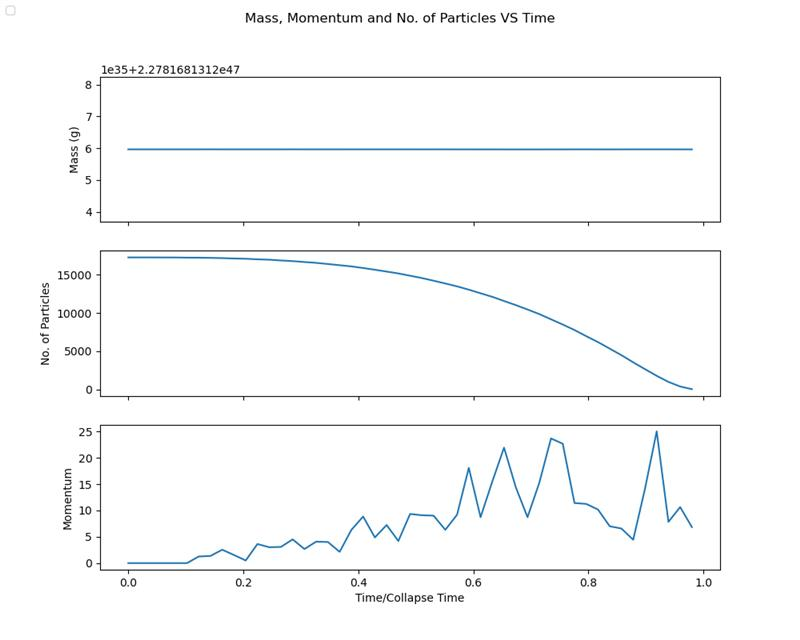
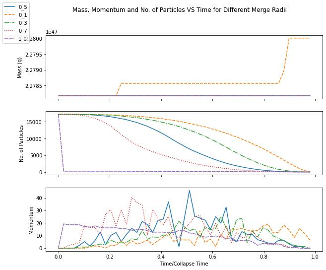
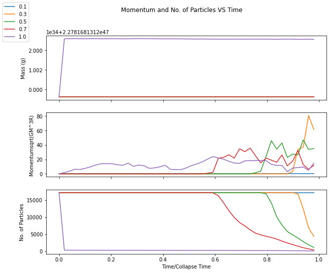
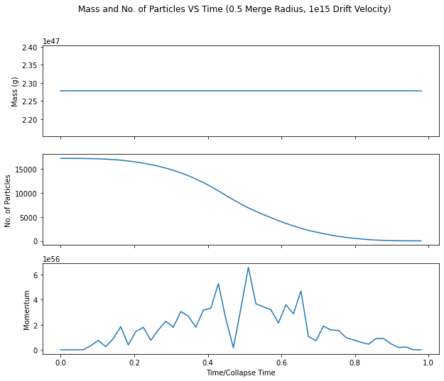

***********************
Particle Merging
***********************
..
 Variables in input file
 #######################

 -------
 Initial
 -------

 The :p:`Initial` group is used to specify initial conditions.  :p:`cycle` specifies the initial cycle number (usually 0), :p:`list` #s\
 pecifies a list of initial conditions, which may include ``"value"`` for initializing fields directly, or other problem-specific ini#t\
 ial condition generators.

..
 .. include:: initial.incl

 ------
 Method
 ------

  .. include:: method.incl

 Parameters
 ##########
 Domain
 * lower = [ -2.0e17, -2.0e17, -2.0e17];

 * rank = 3;

 * upper = [ 2.0e17, 2.0e17, 2.0e17 ];

 Initial

 * Infall_speed

 * centre = [0.0,0.0,0.0];

 * drift_velocity = [1.0,0.0,0.0];

 * truncation_radius = 5.0e16;

 * density = 1.0e-19;

 Method 

 * list = [ "pm_deposit", "gravity", "pm_update","merge_stars"];
   * To turn off gravity remove "gravity" and
   * To turn off merging remove "merge_stars" from list

 * max_dt = 1e12

 * merging_radius_cells = 1.0

   This determines how close star particles have to get to merge, the numerical value refers to cells rather than any physical unit.

Tests
#####
How to run tests:

* Change the parameters file.
  
* Run the script run.sh with "nohup ./run.sh".
  
  This will:
  
  * Remove DIR directories and .png files from previous runs
    
  * Run Enzo-e for the specified parameters
    
  * Run make_images.py in parallel

  * Run data.py

  * Run multiple.py
    
* After running it will output:
  
  * Images of a cross section of the star particles at each time interval. (Output of make_images.py)
    
    .. figure:: cross_section_image.png
          :width: 590px
          :align: center
          :height: 470px
	  :alt: alternate text
	  :figclass: align-center

	  Cross Section of Sphere of star paricles at initial time
		     
  * A .txt file named merge_data_1_0.txt (where 1_0 refers to a merging cells radius of 1.0), which contains the sum of the velcities and the mass of all the star particles as well as the number of particles for each time interval. (output of data.py)

    The data in the file is in the form:
    
    +--------------+--------------+--------------+------+------------------+------+
    | X velocities | Y velocities | Z velocities | Mass | No. of particles | Time |
    +--------------+--------------+--------------+------+------------------+------+
    
  * A graph of Mass, Normalised momentum and No. of particles VS Time/Collapse Time. (output of data.py)

    .. figure:: Mass_momentum_particles_graph_0_3centreofblock.png
          :width: 590px
          :align: center
          :height: 470px
          :alt: alternate text
          :figclass: align-center
		     
          Graph of Mass, Momentum and No. of Particles VS Time for 0.3 Merging radius with Gravity Off
  * A graph of Mass, Normalised momentum and No. of particles VS Time/Collapse Time for different merge radii using data from previous runs

Test 1
######

For the first test, merging is turned off to check that momentum and mass are conserved.

* Remove "merge_stars" from Method: list in the parameters file.

* Check that "pm _deposit" and "gravity" are in Method: list.

* Check that Initial: Infall_speed=0.0
  
* Run test using "nohup ./run.sh"

    Graph of Momentum VS Time with merging off

For the rest of the tests merging is turned on, so "merge_stars" should be added back into Method: list in the parameters file.

Test 2
######

For this test gravity is turned off, the centre of the collapse is positioned in the centre of a block to ensure any errors are not coming from errors in particles being copied across blocks, and the truncation radius is made very small so that there are fewer particles. Momentum and mass should be conserved, the particle number should decrease.

* Remove "pm _deposit" and "gravity" from Method: list in the parameters file.

* Set Initial: infall_speed to

* Set collapse_centre in Initial to be [] in parameters file.

* Set upper/lower bounds in Domain to be [] in parameters file.

* Set truncation_radius in Initial to be 3.0e23 in parameters file.

* Run test using "nohup ./run.sh"

* Run the test for multiple merge radii by changing merging_cell_radius in Method: merge_stars

* Graph all radii on one plot by running multiple.py

    Graph of Momentum, Mass and No. of particles VS Time with gravity off and small truncation radius in one block

Test 3
######

Test 3 is like test 2 but with a larger truncation radius and more particles. It should show similar results to test 2. Momentum and mass should be conserved, the particle number should decrease.

* Set truncation_radius in Initial to be 3.086e24 in parameters file.

* Run test using "nohup ./run.sh"

* Run the test for multiple merge radii by changing merging_cell_radius in Method: merge_stars

* Graph all radii on one plot by running multiple.py

    Graph of Momentum, Mass and No. of particles VS Time with gravity off and large truncation radius in one block

Test 4
######

For this test, the same set up is used, but the collapse centre is changed so that the collapse and merging will take place across blocks. If the results of this test differ greatly from the previous test it will mean there is a problem occuring when particles are being copied across blocks. Momentum and mass should be conserved, the particle number should decrease.

* Set collapse_centre in Initial to be [] in parameters file.

* Set upper/lower bounds in Domain to be [] in parameters file.

* Run test using "nohup ./run.sh"

* Run the test for multiple merge radii by changing merging_cell_radius in Method: merge_stars

* Graph all radii on one plot by running multiple.py

    Graph of Momentum, Mass and No. of particles VS Time with gravity off and large truncation radius

Test 5
######

For this test gravity is turned back on, momentum and mass should still be conserved and the results should be similar to the previous test.

* Add "pm _deposit" and "gravity" from Method: list in the parameters file.

* Run test using "nohup ./run.sh"

* Run the test for multiple merge radii by changing merging_cell_radius in Method: merge_stars

* Graph all radii on one plot by running multiple.py

    Graph of Momentum, Mass and No. of particles VS Time with gravity on and large truncation radius

Test 6
######

For this the drift velocity is changed to a non-zero number to check that momentum and mass are still conserved.

* In the parameters file set Initial: drift_velocity = 

* Run test using "nohup ./run.sh"

* Run the test for multiple merge radii by changing merging_cell_radius in Method: merge_stars

* Graph all radii on one plot by running multiple.py

    Graph of Momentum, Mass and No. of particles VS Time with gravity on, large truncation radius, and non-zero drift velocity

